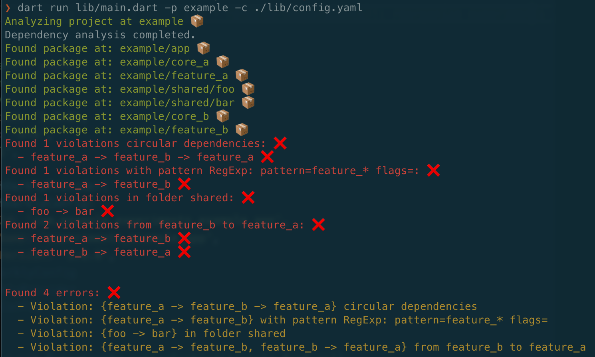

# Dependency Analyzer 📦

A static analysis tool for enforcing architectural boundaries and dependency rules in Dart/Flutter projects.



## Features ✨

- **Circular Dependency Detection**: Automatically detect and prevent circular dependencies between packages
- **Custom Rule Configuration**: Define custom dependency rules via YAML configuration
- **Pattern Matching**: Create rules based on package name patterns
- **Folder-based Rules**: Set up rules for specific folders/directories
- **Clear Violation Reporting**: Get detailed reports of rule violations with clear error messages

## Installation 🚀

Add `dep_analyzer` to your `pubspec.yaml`:

```**yaml**
dependencies:
  dep_analyzer:
    path: ../dep_analyzer
```

## Usage 📝

To run the analysis, use the following command:

```bash
dart run dep_analyzer --project=<path_to_project> --config=<path_to_config> --graph
```

- `--project`: The path to the project to analyze
- `--config`: The path to the config file
- `--graph`: Whether to print the dependency graph

## Configuration 🔧

Create a `config.yaml` file in the root of your project with the rules you want to enforce:

```yaml
rules:
  - key: "no_circular_dependencies"
    description: "Circular dependencies are not allowed"

  - key: "no_package_to_package"
    description: "Features cannot depend on other features"
    from: "pattern:feature_*"
    to: "pattern:feature_*"

  - key: "no_package_to_package"
    description: "Packages cannot depend on other packages in shared folder"
    from: "folder:shared"
    to: "folder:shared"

  - key: "no_package_to_package"
    description: "Feature b cannot depend on feature a and vice versa"
    from: "feature:feature_b"
    to: "feature:feature_a"
    inverse: true # This rule is inverse because we want to avoid circular dependencies
```

### Types of rules

- `pattern`: Matches package names using a regular expression
  - `pattern:feature_*` will match all packages that start with `feature_`
- `folder`: Matches package names based on their containing folder
  - `folder:core` will match all packages that are in the `core` folder
- `feature`: Matches package names based on their name
  - `feature:feature_a` will match all packages that are named `feature_a`

## Contributing 🤝

We welcome contributions to enhance the tool's capabilities and fix any issues. Please see our [CONTRIBUTING.md](CONTRIBUTING.md) for guidelines on how to submit improvements and bug fixes.

## License 📄

This project is licensed under the MIT License. See the [LICENSE](LICENSE) file for details.
